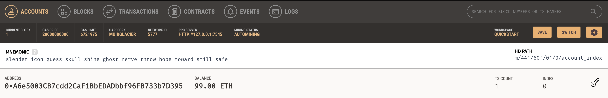
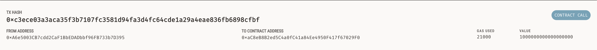

# Simulated Ethereum Transactions

`krypto_jobs.py` simulates a job posting platform that uses ethereum for transactions. Hourly rates are posted and based on the desired hours of work, the total crypto cost can be transacted onto a simulated ethereum blockchain using Ganache.

An example transaction is shown below, with Lane paid for 5 hours of work for a total of 1.0 Ether.


Ganache shows that 1.0 Ether has been transacted (started with 100.0 Ether):


And correspondingly the transaction:


## Setup
1. Install Ganache and open to run the simulated blockchain

2. Install necessary python libraries
```bash
$ pip install streamlit web3 bip44 python-dotenv requests
```
3. Run the application
```bash
$ streamlit run krypto_jobs.py
```
